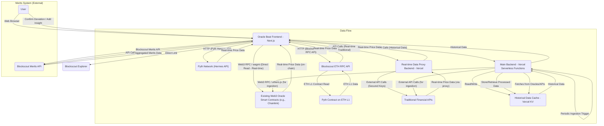

# Architecture for Oracle Beat Application

## 1. Overview

Oracle Beat is a Web3-native application built on **scaffold-eth2** that provides real-time and historical price data comparisons between existing Web3 oracles and traditional financial data sources. Real-time Web3 oracle data (including Pyth data from Pythnet and directly from on-chain contracts via Blockscout API) will be fetched directly by the frontend. Real-time traditional financial data will be fetched via a dedicated small backend proxy to ensure API key security. Historical data will be served by the main Vercel-hosted backend from a key-value cache. The application also features detailed source comparisons, individual provider insights, and a gamified Merits system integrated via API with Blockscout. The entire application's primary components will be deployed on Vercel.

-----

## 2. Core Technologies

  * **Frontend Framework:** React (part of `scaffold-eth2`)
  * **Main Backend (Historical Data):** Vercel Serverless Functions (e.g., Next.js API Routes)
  * **Real-time Data Proxy Backend (Traditional APIs):** Vercel Serverless Functions (e.g., Next.js API Routes / dedicated functions)
  * **Historical Data Storage:** Vercel KV (Redis-compatible Key-Value Cache)
  * **Blockchain Interaction (Frontend Direct Read for Real-time):** `wagmi` hooks, `ethers.js` (for direct RPC interaction if needed, though Blockscout API is preferred for Pyth on-chain)
  * **Traditional API Interaction (via Proxy Backend):** `fetch` API / client-side HTTP libraries (frontend to proxy), Node.js `fetch` (proxy to external API)
  * **Pyth API Interaction (Hermes):** `fetch` API or `@pythnetwork/price-service-client` SDK
  * **On-chain Contract Reads (via Blockscout API):** `fetch` API to Blockscout's ETH RPC endpoint, with `viem` or `ethers.js` for ABI encoding/decoding.
  * **State Management:** React Context API or Zustand/Jotai (recommended for `scaffold-eth2`)
  * **Charting Library:** Recharts, Chart.js, or ApexCharts (for interactive time-series data)
  * **Styling:** DaisyUI (built on Tailwind CSS)
  * **Web3 Wallet Connection:** WalletConnect (via `wagmi`)
  * **Blockchain Explorer & Merits API:** Blockscout (direct linking and API consumption)

-----

## 3. Architecture Diagram (Conceptual)

-----

## 4. Component Breakdown and Integrations

### 4.1 Frontend (`scaffold-eth2` / Next.js / React)

This is the primary user interface, serving as the user's direct interaction point with Oracle Beat.

  * **User Authentication:** Handled via **WalletConnect** using `wagmi` hooks, allowing seamless Web3 wallet connection.
  * **Asset Pair Selection (Step 1):** Provides intuitive dropdowns/autocomplete for users to select asset pairs. The list of available data sources updates dynamically based on this selection.
  * **Flexible Source Selection (Step 2):** Users can select multiple data sources (Web3 Oracles, Traditional APIs) for comparison using checkboxes or multi-select dropdowns.
  * **Main Comparison Page:**
      * **Real-time Rates/Prices Display (DIRECT FROM FE):**
          * **Pyth Network (from Pythnet via Hermes API):**
              * **Service:** `https://hermes.pyth.network/v2/updates/price/latest?ids%5B%5D=0xa995d00bb36a63cef7fd2c287dc105fc8f3d93779f062f09551b0af3e81ec30b&parsed=true` (for EUR/USD).
              * **Mechanism:** Direct `fetch` calls or `@pythnetwork/price-service-client` SDK to this public endpoint. The frontend will parse the JSON response (`price`, `conf`, `expo`, `publish_time`). Polling will be implemented for continuous updates.
          * **Pyth Network (from ETH L1 Contract via Blockscout API):**
              * **Contract:** `0x4305FB66699C3B2702D4d05CF36551390A4c69C6` (on Ethereum Mainnet).
              * **Function:** `getPriceUnsafe(bytes32 id)` with `id = 0xa995d00bb36a63cef7fd2c287dc105fc8f3d93779f062f09551b0af3e81ec30b` (for EUR/USD).
              * **Reference:** [Pyth Network API Reference for `getPriceUnsafe`](https://www.google.com/search?q=%5Bhttps://api-reference.pyth.network/price-feeds/evm/getPriceUnsafe%5D\(https://api-reference.pyth.network/price-feeds/evm/getPriceUnsafe\))
              * **Mechanism:** HTTP POST requests to `https://eth.blockscout.com/api/eth-rpc` using the `eth_call` JSON-RPC method. The `data` payload will be the ABI-encoded function call. The frontend will then decode the raw hex result into the Pyth `Price` struct using `viem` or `ethers.js`.
          * **Other Web3 Oracles (e.g., Chainlink):** Direct interaction using `wagmi` hooks to read data feeds from existing on-chain oracle smart contracts (where supported and preferred over Blockscout API).
          * **Traditional APIs:** **Via Real-time Data Proxy Backend.** Frontend makes `fetch` calls to an endpoint on the proxy backend, which securely forwards the request to the external traditional API.
      * **Base Source Selection & Deviation Display:** The frontend calculates and displays absolute and percentage deviations, including pairwise deviations, directly on the client side.
      * **Interactive Historical Graph:** Fetches historical data from the **Main Backend**. Historical depth remains a consideration based on Vercel KV limits.
      * **Historical Statistics Summary:** Calculates and displays key statistics (average, min, max, deviation) from the fetched historical data.
      * **Real-time Deviation Detection (Client-side):** If real-time alerts are needed, the frontend will implement its own detection logic by comparing the directly fetched real-time data streams.
      * **Merits Integration:** Direct **API calls to the Blockscout Merits API** are made from the frontend when users confirm deviations or add historical insights.
  * **Source Comparison Matrix:** Displays a tabular comparison of data source characteristics, fetching data from the Main Backend.
  * **Individual Data Source Detail Pages:** Provides in-depth information about each provider, including a dedicated historical graph and the "Social Feedback View."
  * **Social Feedback View (Merits Integration):** Fetches aggregated Merits data for specific oracles directly from the **Blockscout Merits API**, displaying top asset pairs and recent user insights.
  * **Blockscout Links:** All links leading to an explorer (e.g., transaction details, contract addresses) are direct `<a>` tags pointing to Blockscout URLs.
  * **Sharing Functionality:** Generates unique, parameterized URLs to recreate specific comparison setups, enabling easy social sharing.
  * **User Experience & Interface Design:** Emphasizes a modern, clean UI built with **DaisyUI (on Tailwind CSS)**, prioritizing clarity, responsiveness, and performance.
  * **Merits Display/Notifications:** Displays the user's Merits balance (fetched from Blockscout Merits API) and provides in-app notifications for earned Merits.

### 4.2 Main Backend (Vercel Serverless Functions / Next.js API Routes)

This backend's primary role is to serve historical data and manage its ingestion into the cache. It will be deployed as serverless functions on Vercel.

  * **API Layer:** Exposes RESTful API endpoints for the frontend:
      * `/api/v1/asset-pairs`: Provides a list of supported asset pairs.
      * `/api/v1/sources?assetPair=<pair>`: Returns data source details supporting a given asset pair, with characteristics.
      * `/api/v1/price/history?assetPair=<pair>&sources=<sources>&startDate=<date>&endDate=<date>`: Delivers historical price data.
  * **Historical Data Ingestion & Retrieval Layer:**
      * **Vercel KV:** Serves as the high-performance, Redis-compatible key-value cache for historical price data.
      * **Ingestion Strategy:** Given the serverless environment, data ingestion into Vercel KV will be triggered periodically by **Vercel Cron Jobs**. These jobs will execute dedicated serverless functions that fetch the latest historical data from Web3 oracles (using `ethers.js` for direct RPC calls or potentially Blockscout API if desired for consistency) and Traditional APIs (using their securely stored API keys), normalize it, and store it efficiently in Vercel KV. On-demand caching for cache misses is also a possibility.
      * **Data Persistence:** While Vercel KV offers speed, it is a cache. Long-term data persistence for very deep historical analysis (e.g., beyond a few months) might require a dedicated, more robust database in a future iteration, depending on requirements and data volume.

### 4.3 Real-time Data Proxy Backend (Vercel Serverless Functions)

This is a **new, dedicated small backend** solely for securing and proxying requests to traditional financial data APIs for real-time data.

  * **Purpose:** To prevent the exposure of confidential API keys directly in the frontend code.
  * **Deployment:** Composed of one or more lightweight Vercel Serverless Functions.
  * **Functionality:**
      * Exposes a simple API endpoint (e.g., `/api/proxy/realtime-price`).
      * Receives real-time data requests from the frontend (e.g., for a specific `assetPair` and `sourceId`).
      * Securely retrieves the necessary API key from its Vercel Environment Variables.
      * Forwards the request to the actual external traditional API.
      * Returns the received data from the traditional API back to the frontend.

### 4.4 External Integrations

  * **Pyth Network Hermes API:** The primary off-chain source for Pyth's real-time aggregated data, directly consumed by the frontend.
  * **Blockscout ETH RPC API:** Utilized by the frontend to securely read Pyth's on-chain data directly from the Ethereum L1 contract, abstracting direct RPC interaction.
  * **Other Existing Web3 Oracle Networks:** Directly interacted with by the frontend (e.g., Chainlink via `wagmi`) for real-time data, and by the Main Backend for historical data ingestion.
  * **Traditional Financial Data APIs:** Accessed by the Real-time Data Proxy Backend for real-time data, and by the Main Backend for historical data ingestion. API keys are securely stored within these respective backends.
  * **Blockscout Explorer:** Direct linking from the frontend, ensuring transparency and verifiability of on-chain activity.
  * **Blockscout Merits API:** The central point for all Merits-related interactions, accessed directly by the frontend for user contributions and aggregated insights.

-----

## 5. Data Flow and Life Cycle

1.  **User Onboarding:** User connects their Web3 wallet via WalletConnect.
2.  **Asset Pair & Source Selection:** The frontend retrieves available sources and asset pairs metadata from the **Main Backend**.
3.  **Real-time Data Display:**
      * For **Pyth (Pythnet/Hermes):** Frontend makes **direct HTTP calls** to the Hermes API.
      * For **Pyth (ETH L1 Contract):** Frontend makes **HTTP POST requests** to the Blockscout ETH RPC API (`eth_call` method) to read the contract data.
      * For **Other Web3 Oracles:** Frontend makes **direct `wagmi` calls** to relevant on-chain contracts.
      * For **Traditional APIs:** Frontend makes **API calls to the Real-time Data Proxy Backend**, which then securely fetches and relays the data.
      * The frontend immediately displays the real-time prices and dynamically calculated deviations.
4.  **Historical Data Display:**
      * The frontend requests historical data (asset pair, sources, date range) from the **Main Backend**.
      * The **Main Backend** first checks **Vercel KV**. If the data is present, it's returned quickly. If not (or incomplete), the backend fetches it from the original sources (Web3 or Traditional APIs) and stores it in Vercel KV, then returns it to the frontend.
5.  **Historical Data Ingestion (Backend/Cron):**
      * A scheduled **Vercel Cron Job** triggers a function within the **Main Backend**.
      * This function autonomously fetches recent historical data from various Web3 oracles and traditional APIs (using their internal, secure API keys) and populates/updates the **Vercel KV** cache.
6.  **Merits Integration (Deviation Hunter & Historical Insight):**
      * Upon user action (e.g., confirming a deviation or adding an insight), the frontend makes a direct **API call to the Blockscout Merits API**, including necessary user wallet information for authentication.
      * Blockscout processes the request and awards Merits. The frontend updates based on the API response.
7.  **Social Feedback View:** The frontend makes direct **API calls to the Blockscout Merits API** to retrieve aggregated Merits data specific to each oracle, which is then displayed to the user.
8.  **Sharing:** The frontend generates a unique, parameterized URL that can be shared, recreating the exact comparison setup when opened.

